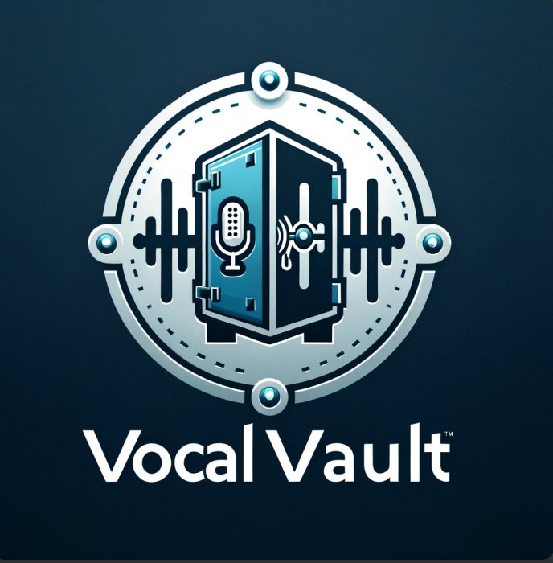

<div style="display: flex; justify-content: center; align-items: center">
    
</div>

## VocalVault
VocalVault is a two-factor authentication method that uses voice authentication using the CNN machine learning model WavLM and PyTorch to extract embeddings from voices and calculate cosine similarity to validate users on sign-in. The application uses ReactJS for the frontend and Python with Flask for the backend.

## Requirements
To run VocalVault, you will need the following libraries:

- Python 3.6 - 3.11
- Flask
- Torch
- Firebase-admin
- Numpy
- Tqdm
- Transformers
- Librosa
- Python-dotenv
  
## Usage
1. Clone the repository
```
git clone https://github.com/ElyasBelkhir/VocalVault.git
```
2. Run the React app
```
cd frontend
npm install
npm run dev
```
3. Start the virtual environment
```
cd backend
virtualenv myenv
```
Windows Do
```
myenv\Scripts\activate
```
Mac/Linux Do
```
source myenv/bin/activate
```
4. Install the required libraries
```
pip install -r requirements.txt
```
5. Run the Flask app
```
flask run
```

## Model Training
The WavLM model is a CNN model trained on 60K+ hours of speech. We used the WavLM to extract feature embedding vectors from audio files using PyTorch with CUDA processing. We then normalized embeddings across the last dimension and used PyTorch's cosine similarity method to calculate and verify speaker identity. 

## Frontend
The VocalVault frontend was built using ReactJS, a JavaScript library for building user interfaces. The user can record or upload an audio file on signup that is used to validate the user on sign-in and stored using Firebase Cloud Storage. On sign-in, the user records themselves again, and the frontend sends a POST request to the backend to process the user's sign-in. Once the backend has processed the audio files, the user is either verified and directed to their dashboard or redirected back to sign-in.

## Backend
The VocalVault backend was built using Python with Flask, a micro web framework. The backend receives the sign-in request from the frontend, extracts the embeddings from both the sign-up and sign-in audios using the WavLM speech processing model, and calculates the cosine similarity between the two embeddings. The model returns the predicted validation choice, which must meet a certain threshold to successfully validate the user and is then sent back to the frontend.
